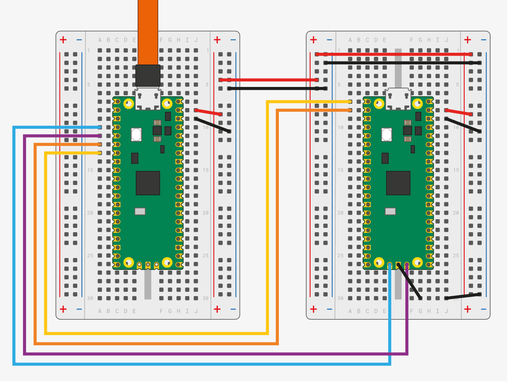

# Pico

Pico is a [RP2040](https://en.wikipedia.org/wiki/RP2040) microcontroller board

# SDK

## Prerequisites

[Arm GNU Toolchain](https://developer.arm.com/downloads/-/arm-gnu-toolchain-downloads):

```bash
xcode-select --install
brew install --cask gcc-arm-embedded
```

Debian / Ubuntu:

```bash
sudo apt install git tar cmake python3 build-essential gcc-arm-none-eabi libnewlib-arm-none-eabi libstdc++-arm-none-eabi-newlib g++
```

## Install SDK

```bash
brew install cmake
brew install --cask gcc-arm-embedded

mkdir $HOME/pico && cd $HOME/pico

git clone -b master --recurse-submodules https://github.com/raspberrypi/pico-sdk.git
git clone https://github.com/raspberrypi/pico-extras.git
git clone -b main --recurse-submodules https://github.com/FreeRTOS/FreeRTOS-Kernel.git
git clone https://github.com/pimoroni/pimoroni-pico.git

# Add to .bashrc
export PICO_SDK_PATH="$HOME/pico/pico-sdk"
export PICO_EXTRAS_PATH="$HOME/pico/pico-extras"
export FREERTOS_KERNEL_PATH="$HOME/pico/FreeRTOS-Kernel"
export PIMORONI_PICO_PATH="$HOME/pico/pimoroni-pico"

# https://embecosm.com/downloads/tool-chain-downloads/#core-v-top-of-tree-compilers
export PICO_RISCV_TOOLCHAIN_PATH="$HOME/.pico-sdk/toolchain/RISCV_RPI_2_0_0_5"
# https://developer.arm.com/downloads/-/arm-gnu-toolchain-downloads
export PICO_ARM_TOOLCHAIN_PATH="$HOME/.pico-sdk/toolchain/14_2_Rel1"
export PICO_TOOLCHAIN_PATH="$PICO_ARM_TOOLCHAIN_PATH"
```

## Verify examples are built succesfully

```bash
cd $HOME/pico
git clone https://github.com/raspberrypi/pico-examples.git

# Build something with default compile settings
cd $HOME/pico/pico-examples
mkdir build && cd build
cmake ..
cd pwm/led_fade
make -j4

# RP2350 + debug
cd $HOME/pico/pico-examples
mkdir build_rp2350 && cd build_rp2350
cmake .. -DPICO_BOARD=pico2 -DCMAKE_BUILD_TYPE=Debug
cd freertos/hello_freertos
make -j4

# Universal binary
cd $HOME/pico/pico-examples
mkdir build_uni && cd build_uni
cmake .. -DPICO_RISCV_TOOLCHAIN_PATH="$PICO_RISCV_TOOLCHAIN_PATH" -DPICO_ARM_TOOLCHAIN_PATH="$PICO_ARM_TOOLCHAIN_PATH" -DCMAKE_BUILD_TYPE=Debug
cd universal
make
ls -la hello_universal/hello_universal.uf2
```


# [debugprobe](https://github.com/raspberrypi/debugprobe)

```bash
git clone https://github.com/raspberrypi/debugprobe
cd debugprobe
git submodule update --init
mkdir build && cd build

cmake -DDEBUG_ON_PICO=ON ..
make -j4

cp debugprobe_on_pico.uf2 /Volumes/RPI-RP2/
```

## Connections



SWD:

```
GND -> GND
GP2 -> SWCLK
GP3 -> SWDIO
```

UART:

```
GP4/UART1 TX -> GP1/UART0 RX
GP5/UART1 RX -> GP0/UART0 TX
```

## Usage (UART)

```bash
ls /dev | grep usb
screen /dev/tty.usbmodem14302 115200
# screen /dev/ttyACM0 115200
# Ctrl+A,Ctrl+\ to exit
```

Or with minicom:

```bash
brew install minicom

ls /dev | grep usb
minicom -b 115200 -D /dev/tty.usbmodem14302
# minicom -b 115200 -D /dev/ttyACM0
# Esc+X to exit, Esc+Z for menu
```

Expose hardware serial console as a telnet server with `socat`:

```bash
socat TCP-LISTEN:1234,bind=127.0.0.1,reuseaddr,fork FILE:/dev/ttyACM0,b115200,raw,echo=0
telnet localhost 1234
```

Alternatives:

- [VSCode Serial Monitor plugin](https://marketplace.visualstudio.com/items?itemName=ms-vscode.vscode-serial-monitor)
- [CoolTerm](https://freeware.the-meiers.org)


## Usage (SWD)

### Upload binaries

```bash
brew install openocd

# Produce an elf file
# make -j4

sudo openocd -f interface/cmsis-dap.cfg -f target/rp2040.cfg -c "adapter speed 5000" -c "program blink.elf verify reset exit"
```

### Debug with SWD

[GDB with MacOS](https://sourceware.org/gdb/wiki/PermissionsDarwin)

[LLDB](https://lldb.llvm.org/)

```bash
# Produce an elf file with the debug symbols
cmake -DCMAKE_BUILD_TYPE=Debug -DPICO_BOARD=pico ..
make -j4

# Run an OpenOCD server:
sudo openocd -f interface/cmsis-dap.cfg -f target/rp2040.cfg -c "adapter speed 5000"

# Run debugger in another tab:
gdb blink.elf
> target remote localhost:3333
> monitor reset init
> continue

```


# [Picotool](https://github.com/raspberrypi/pico-sdk-tools/blob/main/packages/linux/picotool/build-picotool.sh)

```bash
# Prerequisites
brew install libusb pkg-config

# Build and install
cd $HOME/pico
git clone https://github.com/raspberrypi/picotool.git
cd picotool
mkdir build && cd build
cmake ..
make
sudo make install
```

## Usage

```bash
picotool info -bp
picotool load --verify -F hello_freertos2.uf2
```